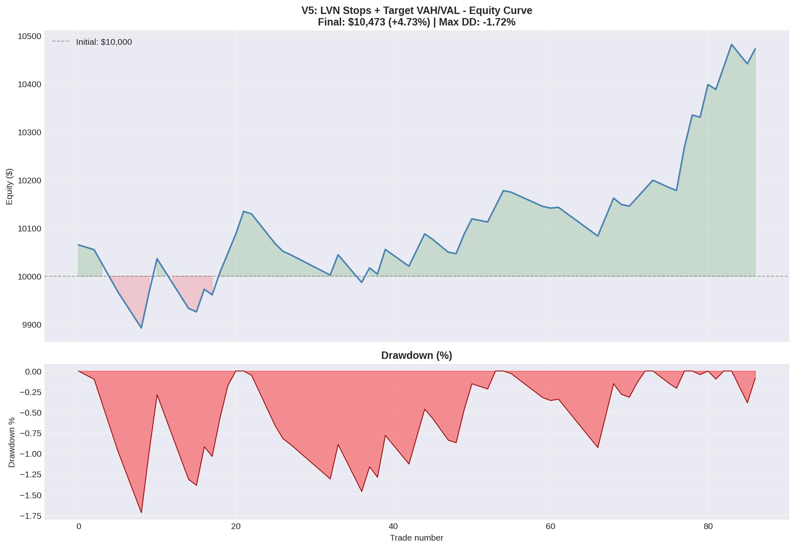

# Volume Profile Backtesting — QQQ

A systematic backtest of a Volume Profile trading strategy on QQQ (Nasdaq 100 ETF), iterating through five strategy variants to study how entry filters, stop placement, and timeframe affect performance.

## Overview

This project builds a Volume Profile engine from scratch in Python (no trading libraries) and uses it to backtest a mean-reversion-to-value strategy. The goal was not to find a "holy grail" but to study, with real data, how design choices affect risk-adjusted returns.

## Methodology

**Data:** QQQ 5-minute bars, 60 days, via `yfinance` (used as a proxy for NQ futures).

**Volume Profile:** Calculated POC (Point of Control), VAH/VAL (Value Area High/Low), and Low Volume Nodes (LVN) for each trading day and week. Each period was traded using the *previous* period's profile to avoid look-ahead bias.

**Strategy logic:** Mean reversion to value, entering at Value Area edges, filtered by an EMA(3/9) trend filter and a minimum Risk:Reward threshold.

## Strategy Iterations

| Version | Description | Trades | Win Rate | Total Return | Avg R:R |
|---------|-------------|--------|----------|--------------|---------|
| v1 | Pure mean reversion | 238 | 58.0% | -8.59% | — |
| v2 | EMA filter + POC target | 164 | 64.6% | +0.75% | — |
| v3 | EMA + extended target | 99 | 34.3% | -7.48% | — |
| v5 | LVN stops + R:R ≥ 2 filter | 87 | 33.3% | +4.66% | 6.51 |

## Key Findings

**Risk:Reward dominates win rate.** The variant with the *lowest* win rate (v5, 33%) delivered the *best* return, because tight LVN-based stops produced an average R:R of 6.5:1. The highest win-rate variant (v1, 58%) was the worst performer.

**Trend filtering matters.** Adding an EMA filter turned a losing strategy (v1) into a profitable one (v2) by avoiding counter-trend trades.

**Stop placement is critical.** Stops anchored to Low Volume Nodes (structural levels) outperformed arbitrary percentage-based stops.

**Best strategy (v5):** +4.73% with a maximum drawdown of only -1.72% — a smooth equity curve, though performance was aided by a trending market over the test period.

## Daily vs Weekly

The daily timeframe outperformed weekly (+4.66% vs +0.68%) in this period. The weekly approach showed a higher theoretical R:R (12.58) but suffered from insufficient sample size (only 13 weeks of data), preventing its edge from materializing.

## Limitations

- 60-day sample is short; results are not statistically robust
- Strategy performed in a strongly trending market — needs testing in ranging conditions
- No transaction costs or slippage modeled
- Free intraday data limits historical depth

## Tech Stack

Python · pandas · numpy · matplotlib · yfinance · Google Colab

## About

Built as part of my portfolio, combining my background in derivatives and financial markets with quantitative analysis and Python.
